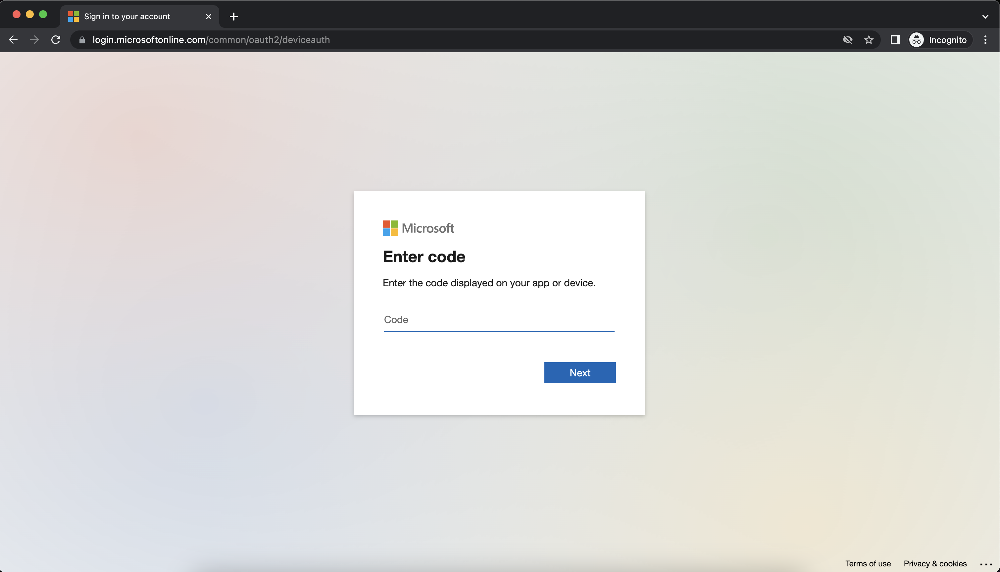

# Project OverView

In this mini project will learn how to provision and Manage Cisco Secure firewall in Azure using Ansible and Terraform

## Prerequisites

* Azure account with correct privilege (Write and Read , Delete)
* Az cli installed locally if not then install&#x20;

```sh
curl -sL https://aka.ms/InstallAzureCLIDeb | sudo bash
```

<details>

<summary>Azure CLI Login </summary>

`az login --use-device-code`

_To sign in, use a web browser to open the page https://microsoft.com/devicelogin and enter the code XXXXXXXXX to authenticate._

*   Open the page in your browser and paste the code to authenticate:

    <figure><figcaption></figcaption></figure>


*   Enter your email and login with credentials:

    <figure><figcaption></figcaption></figure>


*   Press Continue&#x20;

    <figure><figcaption></figcaption></figure>


*   az cli logged in&#x20;

    <figure><figcaption></figcaption></figure>

&#x20; &#x20;


</details>


[lab-0](lab-0/)


